# BoolSi

BoolSi is a command line tool for distributed simulations 
and analysis of synchronous Boolean networks. It uses MPI 
standard to allow execution on computational clusters, as well as 
parallel processing on a single computer.

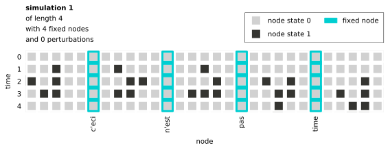

BoolSi can simulate a Boolean network from a range of initial states, 
identify and analyze network attractors, and find conditions that lead 
to specific states of the network. It also allows user to fix the state 
of any network node for the length of entire simulation (e.g. modeling 
gene knockout in regulatory networks), or perturb the state of the node 
at any time step (e.g. modeling sensory input in robotics).

- [Installation](#installation)
    - [Prerequisites](#prerequisites)
    - [PIP](#pip)
    - [Install from source](#install-from-source)
- [MPI usage](#mpi-usage)
- [Quickstart](#quickstart)
    - [Example 1. Simulate network from `example1.yaml` for 5 steps](#example-1-simulate-network-from-example1yaml-for-5-steps)
    - [Example 2. Find and analyze attractors of a network](#example-2-find-and-analyze-attractors-of-a-network)
    - [Example 3. Find simulations that reach specific states of a network](#example-3-find-simulations-that-reach-specific-states-of-a-network)
- [Advanced usage](#advanced-usage)
    - [Fixed nodes](#fixed-nodes)
    - [Perturbations](#perturbations)
- [Command line reference](#command-line-reference)
- [Input file reference](#input-file-reference)
- [Output](#output)
    - [Graphical](#graphical)
    - [CSV](#csv)
- [Questions and feedback](#questions-and-feedback)
- [Citations](#citations)
- [License](#license)

## Installation
### Prerequisites
BoolSi requires:
* Python 3.4 or higher

To use BoolSi with MPI you must also install:

* MPI Implementation (OpenMPI, MPICH)
* mpi4py Python library (https://mpi4py.readthedocs.io/)

For MPI Implementation installation instructions, please refer to vendor 
documentation:

* OpenMPI (https://www.open-mpi.org) 
* MPICH (https://www.mpich.org)

We also expect BoolSi to work with other MPI Implementations, although 
they have not been tested. 

To install mpi4py:

    $ pip install mpi4py

All other Python package dependencies will be installed automatically 
when installing BoolSi.

### PIP

    $ pip install boolsi

### Install from source

    $ git clone https://github.com/boolsi/boolsi.git
    $ cd boolsi
    $ pip install .

## MPI usage

To run BoolSi using MPI:

    $ mpiexec -np [NUMBER OF PROCESSES] boolsi ...

Note that forceful termination in MPI (Abort) does not guarantee 
graceful shutdown of an application. 
As a consequence, aborting MPI run on Windows or in `attract` mode 
without the flag `-i` may leave orphaned files in the database directory 
(defaults to "\<current directory\>/tmp_db"). 
## Quickstart

BoolSi provides 3 terminal commands to simulate Boolean networks:

- `simulate` to simulate for a number of time steps
- `attract` to find attractors (and analyze them for node correlations)
- `target` to find conditions leading to specific states of the network

Each command supports running simulations from multiple initial states at once, 
limiting the simulation time, and overriding the simulation process (see [Advanced usage](#advanced-usage) 
for the latter). All flags and arguments for the commands are covered 
in [Command line reference](#command-line-reference). 

Commands produce different types of output. 
`simulate` produces simulations &mdash; trajectories (sequences of 
network states) that start from the specified initial states of a network.
`attract` produces attractors &mdash; repeating subsequences (of network states) in the trajectories of a network.
`target` produces simulations, but only those that reach the specified target states of a network.
  

Boolean network to simulate needs to be described in a YAML file of the form (`example1.yaml`):

```
nodes:
    - A
    - B
    - C

update rules:
    A: not B
    B: A and C
    C: not A or B
    
initial state:
    A: 0
    B: 1
    C: any
```

[Input file reference](#input-file-reference) provides a detailed description of the input file syntax.

Let's run through some basic examples.

### Example 1. Simulate network from `example1.yaml` for 5 steps

From the command line, run:

`$ boolsi simulate examples/example1.yaml -t 5`

Because the input file `example1.yaml` specifies multiple initial states (by 
using keyword `any` for node `C`), BoolSi will run separate simulation 
for each of them (`A: 0, B: 1, C: 0` and `A: 0, B: 1, C: 1`):

```
18-Aug-2019 20:17:16 Hi! All BoolSi output (including this log) will appear in "/Users/user/boolsi/output_20190818T201716.666/".
18-Aug-2019 20:17:16 Run parameters: "simulate examples/example1.yaml -t 5".
18-Aug-2019 20:17:16 Initializing temporary storage in "/Users/user/boolsi/tmp_db/".
18-Aug-2019 20:17:16 Read Boolean network of 3 nodes.
18-Aug-2019 20:17:16 Single process will be used to perform 2 simulations...
...
```

The above also tells you where to look for the simulations after the run 
is finished (`output_20190818T201716.666/`):

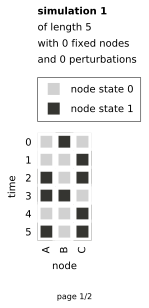 

By default the results are printed in PDF, but other formats are 
available, including machine-readable CSV (see [Output reference](#output-reference)). 

### Example 2. Find and analyze attractors of a network

The input file `example1.yaml` specifies 2 initial states of the network to 
simulate from. If we want to find all attractors of the network, we need 
to simulate it from all possible initial states. For this, we create the
input file `example2.yaml`, where the initial state of every node is set 
to `any`:

```
nodes:
    - A
    - B
    - C

update rules:
    A: not B
    B: A and C
    C: not A or B
    
initial state:
    A: any
    B: any
    C: any
```

Running the command:

`$ boolsi attract examples/example2.yaml`

will find all attractors and calculate correlations between the node states therein.

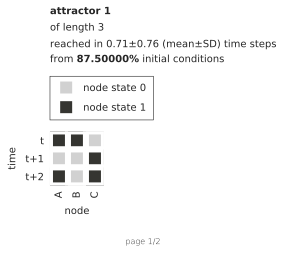 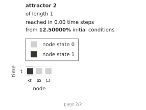 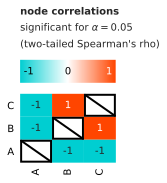

### Example 3. Find simulations that reach specific states of a network

If we want to find conditions that lead to the states where e.g. `A` is `0` 
and `B` is `1`, we first need to specify them as target states. For 
this, we create input file `example3.yaml` with added section 
`target state`. We also set the initial state of `A` to `1` in order to
omit the trivial results, when the network starts in a target state.
 
```
nodes:
    - A
    - B
    - C

update rules:
    A: not B
    B: A and C
    C: not A or B
    
initial state:
    A: 1
    B: any
    C: any
   
target state:
    A: 0
    B: 1
    C: any
```

Running the command:

`$ boolsi target examples/example3.yaml`

will find the simulations reaching either `A: 0, B: 1, C: 0` or `A: 0, B: 1, C: 1`.


## Advanced usage

BoolSi allows overriding the simulation process, which can be used to model 
external influence on the network. User can fix the state of any node 
for the entire simulation (e.g. modeling gene knockout in regulatory 
networks), or perturb it at any individual time step (e.g. modeling sensory input 
in robotics).

### Fixed nodes

To permanently fix the state of a node, specify it under the `fixed nodes` 
section of the input file. For example, these lines set the state of 
node `A` to `0` and `B` to `1` for the entire simulation:

```
fixed nodes:
    A: 0
    B: 1
```

Adding the above to `example1.yaml` will make the simulations look like:

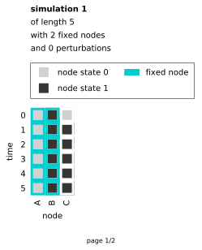 

When running `simulate` or `target`, it is also possible to use `0?`, `1?`, `any`, `any?` values.

```
    C: 0?
```

`0?` (`1?`) doubles the number of produced simulations by fixing the 
state of node `C` to `0`(`1`), as well as simulating with unfixed `C`.


```
    C: any
```

`any` doubles the number of simulations by fixing the state of `C` 
separately to `0` and to `1`. 

```
    C: any?
```

`any?` triples the number of simulations by fixing the  state of `C` 
separately to `0` and `1`, as well as simulating with unfixed `C`. 

### Perturbations

To force a node into a particular state at an individual time step, use 
`perturbations` section. For example, to set the state of node `A` to 
`0` at time step `4` and to `1` at time step `5`, and to set the state of node 
`B` to `1` at time steps `1, 2, 3, 5`:

```
perturbations:
    A: 
        0: 4
        1: 5
    B:
        1: 1-3, 5
```

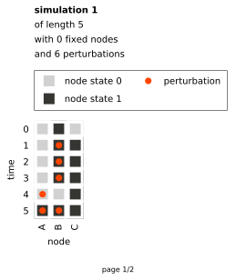 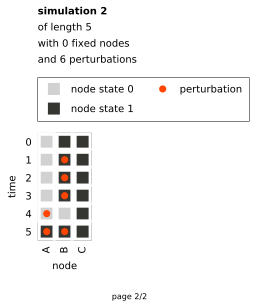

Similarly to `fixed nodes`, it is possible to use `0?`, `1?`,`any`, 
`any?` values when running `simulate` or `target`. For example, the 
following lines increase the number of produced simulations by a factor 
of 2<sup>4</sup> = 16 because the state to force `C` into (`0` or `1`) 
is considered independently at each time step.  

```
perturbations:
    C: 
        any: 2, 3, 5, 7
```
 
When running `attract` or `target`, BoolSi starts looking for attractors 
or target states only after all perturbations have occurred.

## Command line reference

To run BoolSi, open the terminal and type:
 
`boolsi COMMAND [ARGS] [OPTIONS]`

You can stop BoolSi at any point by pressing `Ctrl+C`.

### Commands:

`simulate` Perform simulations.

`attract` Find (and analyze) attractors.

`target` Find simulations that reach target states.

### Common arguments:

`input_file` **\[required\]** Path to YAML file describing the Boolean network. 

### Common options

`-h`, `--help` Prints help for the current command.

`-o`, `--output-directory` Directory to print output to. Defaults to "\<current directory\>/output_\<timestamp\>".

`-b`, `--batches-per-process` Number of batches to split the expected simulations of one process into. Defaults to 100. Increasing it reduces memory usage and makes the distribution of the simulations more even, but decreases the performance. 

`-d`, `tmp-database-directory` Directory to store intermediate results in. Defaults to "\<current directory\>/tmp_db".

`--no-pdf` Disable PDF output. PDF output is enabled by default.

`--pdf-page-limit` Maximum number of PDF pages to print. Defaults to 100. Only works when PDF output is enabled.

`--no-csv` Disable CSV output. CSV output is enabled by default.

`--print-png` Enable PNG output. PNG output is disabled by default.

`--png-dpi` PNG dpi. Defaults to 300. Only works when PNG output is enabled.

`--print-tiff` Enable TIFF output. TIFF output is disabled by default.

`--tiff-dpi` TIFF dpi. Defaults to 150. Only works when TIFF output is enabled.

`--print-svg` Enable SVG output. SVG output is disabled by default.

### `simulate` options

`-t`, `--simulation-time` **\[required\]** Number of time steps to simulate for.
              
### `attract` options

`-t`, `--max-simulation-time` Maximum simulation time. If set, simulation stops after this time step even if an attractor was not reached. 

`-a`, `--max-attractor-length` Maximum length of attractor to look for. If set, attractors longer than this value are discarded.

`-r`, `--reduce-memory-usage` Turn off storing all simulation states. Slows down the search for attractors.

`-k`, `--keep-stale-db-items` Turn off removing stale attractors from the database on each write. Greatly increases disk space usage, speeds processing up, and makes ETA more accurate.

`-c`, `--no-node-correlations` Turn off computing Spearman's correlations between node states in attractors.

`-x`, `--no-attractor-output` Turn off outputting attractors.

`-p`, `--p-value` <i>p</i>-value threshold for statistical significance of node correlations. Defaults to 0.05.

### `target` options

`-t`, `--max-simulation-time` Maximum simulation time. If set, simulation stops after this time step even if a target state was not reached.

`-n`, `--n-simulations-reaching-target` Stop after this many simulations have reached target state.

## Input file reference
Input file uses YAML syntax to describe a Boolean network and how its state changes over time.
### Node names \[required\]
Section `node names` of input file contains YAML list of node names. Node names must be unique valid YAML strings and contain no whitespaces, parentheses, or commas. In addition, a node name cannot be any of the reserved words `0`, `1`, `and`, `or`, `not`, `majority`.

Node name format is compatible with Python's MathText, allowing for basic TeX-style expressions.
```
node names:
    - A
    - B
    - composite_node_name
    - $X_5$
    - SOMEGENE4
```
### Update rules \[required\]
Section `update rules` contains rules that define the next state of the 
network based on its current state. A rule for each individual node is a 
Boolean function on a subset of the current node states. It is written 
as an expression that can contain node names, logical operators `and`, 
`or`, and `not`, parentheses, constants `0` and `1`, and function `majority`.  

`majority` takes <i>n</i> Boolean inputs and returns `1` if and only if 
more than <i>n</i>/2 of the inputs are `1`. In particular, when <i>n</i> 
is even and exactly half of the inputs are `0` (and the other half is 
`1`), `majority` returns `0`. To change this tie-breaking behavior to 
return `1`, add `1` as an input to the function. Similarly, adding some 
node `X` to an even number of inputs will make `majority` return the
current state of `X` in case of the tie on those inputs.

```
update rules:
    A: (A or not B) and C
    B: 1
    C: majority(not A, B, D)                # Tie cannot happen on odd number of inputs.
    D: majority(A, B)                       # Returns 0 when A and B are tied.
    E: majority(A, B, 1)                    # Returns 1 when A and B are tied.
    F: majority(A, B, B)                    # Returns B when A and B are tied.
    G: majority(A, B, C or D)               # Returns (C or D) when A and B are tied.
    H: A and majority(C, not B, not D, G)
    
```

Note: the update rule for a node is stored as a truth table, whose size 
increases exponentially with the number of the nodes it depends on (its inputs). 
Specifying more than 20 nodes in an individual update rule can put your system at risk 
of running out of memory.

### Initial state \[required\]
Section `initial state` defines the initial state (or the range of initial states) of the network 
to simulate from. The initial state of each node must be specified as either `0`, 
`1`, or `any`. Specifying `any` will simulate from both possible states of the node (`0` 
and `1`), and thus the number of simulations will double.

In the following example, the network will be simulated from both `A: 0, B: 1, C: 0` and `A: 0, B: 1, C: 1`:
```
initial state:
    A: 0
    B: 1
    C: any
```
### Fixed nodes
Section `fixed nodes` allows user to define the nodes whose state doesn't change 
throughout a simulation. Setting a node to a fixed state `0` or `1` simply 
overrides its update rule with a constant, while `any` sets it to both 
`0` and `1` in separate simulations. Their counterparts with `?` (`0?`, 
`1?`, or `any?`) will simulate with both regular and overridden update 
rule of a node. Thus, specifying `any`, `0?`, or `1?` for a node doubles 
the number of simulations, while `any?` triples it. 

```
fixed nodes:
    A: 0
    B: 1
    C: 0?
    D: 1?
    E: any
    F: any?
```

### Perturbations
Section `perturbations` allows user to override node states at individual time 
steps. Similarly to [Fixed nodes](#fixed-nodes), the states to override 
with are defined by `0`, `1`, `any`, `0?`, `1?`, or `any?` but you also 
need to specify time steps when the override takes place.

```
perturbations:
    A: 
        0: 5
        1: 6
    B:
        1: 10, 15-17, 20
    C:
        0?: 100
        1?: 200    
    D:
        any?: 123
``` 
Time steps may be given explicitly (e.g. `5, 6, 7, 8`) or in ranges 
(e.g. `5-8`). They must be 1 or greater (0 corresponds to initial state) 
and can't exceed the maximum simulation time (if specified).

If a perturbation is applied to a node in a fixed state, the fixed state will be 
overridden at the time steps of the perturbation.

Note that the search for attractors and target states starts only after 
the last perturbation has occurred.

### Target state

Section `target state` is only applicable (and required) when executing `target` 
command. It defines the target state (or range of target states) of the network to look for 
in simulations.

The syntax is identical to that of `initial state` &mdash; the state of each 
node must be specified as either `0`, `1`, or `any`, where `any` means 
that both `0` and `1` are acceptable in a target state.

```
target state:
    A: 0
    B: 1
    C: any
```

In the above example, the BoolSi will be looking for the simulations that 
reach either `A: 0, B: 1, C: 0` or `A: 0, B: 1, C: 1`.

## Output
### Graphical
BoolSi supports a number of graphical output formats: PDF, SVG, PNG, and 
TIFF. Each simulation or attractor is printed as a separate page of a 
PDF document and/or as an SVG/PNG/TIFF image file. 

Below is an example output of a Boolean network (namely, Cambium regulation 
network) simulated from a particular initial state for 10 time steps. 
Note that the initial state (at time step 0) is not counted towards the simulation length.

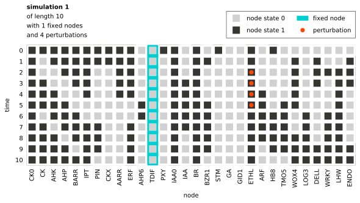

Here is an example output of an attractor of the same network. 
Unlike in simulations, time steps in attractors are relative. Note that 
the first state of an attractor in the output is not guaranteed to be the 
same as the first state of attractor's first occurrence in the simulation. 

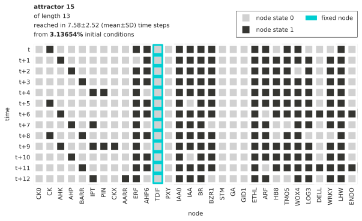

`attract` also prints pairwise Spearman's correlations between the (averaged) node states across all attractors.

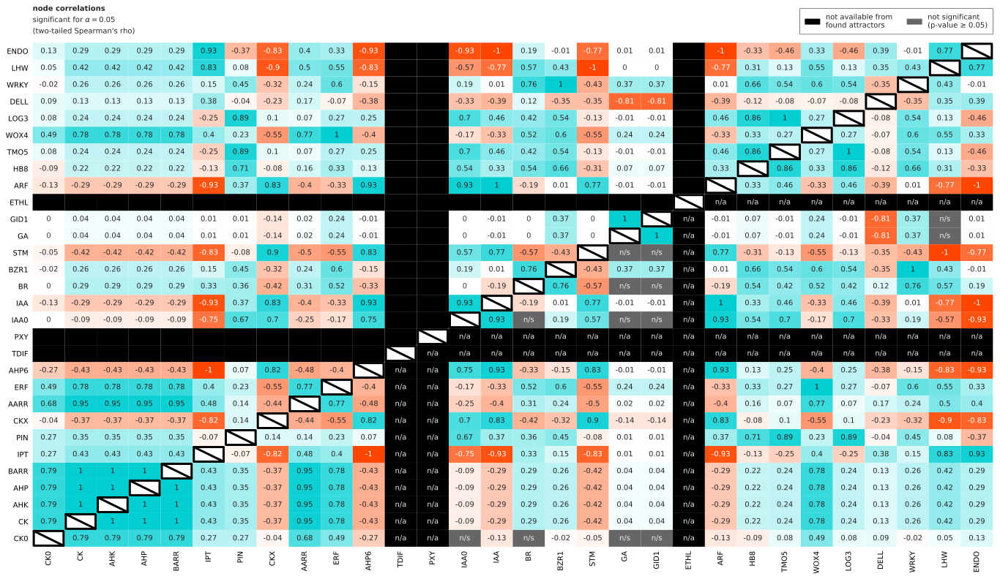

### CSV
By default, BoolSi additionally writes the output to CSV to allow for 
machine processing. The output consists of two CSV files: one with the 
simulation/attractor summaries, and another containing the simulations or attractors themselves. 

The summary of a simulation contains its length, flags representing 
whether individual nodes were fixed, and the number of perturbations for each node:

<!-- ./examples/output7_cambium1/simulation_summaries.csv -->
```
simulation_id,length,CK0_is_fixed,CK_is_fixed,AHK_is_fixed,AHP_is_fixed,BARR_is_fixed,IPT_is_fixed,PIN_is_fixed,CKX_is_fixed,AARR_is_fixed,ERF_is_fixed,AHP6_is_fixed,TDIF_is_fixed,PXY_is_fixed,IAA0_is_fixed,IAA_is_fixed,BR_is_fixed,BZR1_is_fixed,STM_is_fixed,GA_is_fixed,GID1_is_fixed,ETHL_is_fixed,ARF_is_fixed,HB8_is_fixed,TMO5_is_fixed,WOX4_is_fixed,LOG3_is_fixed,DELL_is_fixed,WRKY_is_fixed,LHW_is_fixed,ENDO_is_fixed,n_CK0_perturbations,n_CK_perturbations,n_AHK_perturbations,n_AHP_perturbations,n_BARR_perturbations,n_IPT_perturbations,n_PIN_perturbations,n_CKX_perturbations,n_AARR_perturbations,n_ERF_perturbations,n_AHP6_perturbations,n_TDIF_perturbations,n_PXY_perturbations,n_IAA0_perturbations,n_IAA_perturbations,n_BR_perturbations,n_BZR1_perturbations,n_STM_perturbations,n_GA_perturbations,n_GID1_perturbations,n_ETHL_perturbations,n_ARF_perturbations,n_HB8_perturbations,n_TMO5_perturbations,n_WOX4_perturbations,n_LOG3_perturbations,n_DELL_perturbations,n_WRKY_perturbations,n_LHW_perturbations,n_ENDO_perturbations
simulation1,10,0,0,0,0,0,0,0,0,0,0,0,1,0,0,0,0,0,0,0,0,0,0,0,0,0,0,0,0,0,0,0,0,0,0,0,0,0,0,0,0,0,0,0,0,0,0,0,0,0,0,4,0,0,0,0,0,0,0,0,0
```

The summary of an attractor contains its length, mean and standard 
deviation of its trajectory length, and relative frequency of attractor 
occurrences across all performed simulations:

<!-- ./examples/output8_cambium2/attractor_summaries.csv -->
```
attractor_id,length,trajectory_length_mean,trajectory_length_SD,relative_frequency
attractor1,1,11.018409729003906,2.573900999723755,0.0625
...
attractor15,13,7.5754355559609605,2.5215366582580403,0.031365394592285156
...
```

In a file storing simulations or attractors, `_` after a node state means 
that the state of the node is fixed. `*` after a node state means that 
the node was perturbed into this state at the corresponding time step. 

Simulation example:
<!-- ./examples/output7_cambium1/simulations.csv -->
```
simulation_id,time,CK0,CK,AHK,AHP,BARR,IPT,PIN,CKX,AARR,ERF,AHP6,TDIF,PXY,IAA0,IAA,BR,BZR1,STM,GA,GID1,ETHL,ARF,HB8,TMO5,WOX4,LOG3,DELL,WRKY,LHW,ENDO
simulation1,0,1,1,1,1,1,1,1,1,1,1,0,0_,1,1,0,1,0,1,0,0,1,0,1,0,0,0,0,0,0,0
simulation1,1,1,0,1,1,1,1,1,1,1,1,0,0_,0,1,0,1,1,0,0,0,1,0,0,0,1,0,1,0,0,1
simulation1,2,1,0,0,1,1,1,0,0,1,1,0,0_,0,1,0,1,0,0,0,0,1*,0,0,0,1,0,1,1,1,1
simulation1,3,1,1,0,0,1,1,0,0,1,1,0,0_,0,1,1,1,0,0,0,0,1*,0,0,0,1,0,1,0,1,1
simulation1,4,1,1,1,0,0,1,0,0,1,1,0,0_,0,1,1,1,0,0,0,0,1*,1,0,0,1,0,0,0,1,0
simulation1,5,1,1,1,1,0,0,0,0,0,0,1,0_,0,1,1,1,1,0,0,0,1*,1,0,1,1,0,0,0,1,0
simulation1,6,1,0,1,1,1,0,0,0,0,0,1,0_,0,1,1,1,1,0,0,0,1,1,1,1,0,1,0,1,1,0
simulation1,7,1,1,0,1,1,1,1,0,0,1,0,0_,0,1,1,1,1,0,0,0,1,1,1,1,0,1,0,1,1,0
simulation1,8,1,1,1,0,1,1,1,0,0,1,0,0_,0,1,0,1,1,0,0,0,1,1,1,1,1,1,0,1,1,0
simulation1,9,1,1,1,1,0,1,1,0,0,1,0,0_,0,1,0,1,1,0,0,0,1,0,1,1,1,1,1,1,1,1
simulation1,10,1,1,1,1,1,1,0,0,0,1,0,0_,0,1,0,1,0,0,0,0,1,0,0,0,1,1,1,1,1,1
```

<!-- ./examples/output8_cambium2/attractors.csv -->
Attractor example:
```
attractor_id,time,CK0,CK,AHK,AHP,BARR,IPT,PIN,CKX,AARR,ERF,AHP6,TDIF,PXY,IAA0,IAA,BR,BZR1,STM,GA,GID1,ETHL,ARF,HB8,TMO5,WOX4,LOG3,DELL,WRKY,LHW,ENDO
attractor1,t,0,0,0,0,0,0,0,1,0,0,1,0_,0,1,1,0,0,1,0,0,1,1,0,0,0,0,0,0,0,0
...
attractor15,t,0,1,0,0,0,0,0,0,0,1,1,0_,0,1,1,1,1,0,0,0,1,1,0,1,1,0,0,0,1,0
attractor15,t+1,0,0,1,0,0,0,0,0,0,0,1,0_,0,1,1,1,1,0,0,0,1,1,1,1,1,1,0,1,1,0
attractor15,t+2,0,0,0,1,0,0,0,0,0,1,1,0_,0,1,1,1,1,0,0,0,1,1,1,1,0,1,0,1,1,0
attractor15,t+3,0,0,0,0,1,0,0,0,0,1,1,0_,0,1,1,1,1,0,0,0,1,1,1,1,1,1,0,1,1,0
attractor15,t+4,0,0,0,0,0,1,1,0,0,1,0,0_,0,1,1,1,1,0,0,0,1,1,1,1,1,1,0,1,1,0
attractor15,t+5,0,1,0,0,0,0,0,0,0,1,1,0_,0,1,0,1,1,0,0,0,1,1,1,1,1,1,0,1,1,0
attractor15,t+6,0,0,1,0,0,0,0,0,0,1,1,0_,0,1,1,1,1,0,0,0,1,0,1,1,1,1,1,1,1,1
attractor15,t+7,0,0,0,1,0,1,0,0,0,1,0,0_,0,1,1,1,0,0,0,0,1,1,0,0,1,1,0,1,1,0
attractor15,t+8,0,1,0,0,1,0,0,0,0,1,1,0_,0,1,1,1,1,0,0,0,1,1,0,1,1,0,0,0,1,0
attractor15,t+9,0,0,1,0,0,1,1,1,0,1,0,0_,0,1,1,1,1,0,0,0,1,1,1,1,1,1,0,1,1,0
attractor15,t+10,0,0,0,1,0,0,0,0,0,1,1,0_,0,1,0,1,1,0,0,0,1,1,1,1,1,1,0,1,1,0
attractor15,t+11,0,0,0,0,1,0,0,0,0,1,1,0_,0,1,1,1,1,0,0,0,1,0,1,1,1,1,1,1,1,1
attractor15,t+12,0,0,0,0,0,1,0,0,1,1,0,0_,0,1,1,1,0,0,0,0,1,1,0,0,1,1,0,1,1,0
...
```

In `attract`, Spearman's correlations between the (averaged) node states in attractors 
are written to an additional CSV file. The correlations are sorted by 
their magnitude in descending order, with statistically significant 
correlations printed first:

```
node_1,node_2,rho,p_value
CK,AHK,1.0,0.0
CK,AHP,1.0,0.0
CK,BARR,1.0,0.0
AHK,AHP,1.0,0.0
AHK,BARR,1.0,0.0
AHP,BARR,1.0,0.0
IPT,AHP6,-1.0,0.0
...
```

## Questions and feedback

[BoolSi mailing list](https://mail.python.org/mailman3/lists/boolsi.python.org/) is the preferred way of getting help with BoolSi. Submit a question by sending an email to boolsi@python.org. See all prior discussions in [the mailing list archive](https://mail.python.org/archives/list/boolsi@python.org/).

If you found a bug or want to suggest an enhancement, feel free to create a [GitHub Issue](https://help.github.com/en/github/managing-your-work-on-github/creating-an-issue).

## Citations

If you would like to cite BoolSi, please use the following:
<blockquote>
<p>Oles, V., & Kukushkin, A. (2019). BoolSi: a tool for distributed simulations and analysis of Boolean networks. <i>arXiv preprint arXiv:1910.03736</i>.</p>
</blockquote>
<pre><code>@article{boolsi2019,
	title={BoolSi: a tool for distributed simulations and analysis of Boolean networks},
	author={Oles, Vladyslav and Kukushkin, Anton},
	journal={arXiv preprint arXiv:1910.03736},
	year={2019}
}
</code></pre>

## License

BoolSi is licensed with the MIT license.

